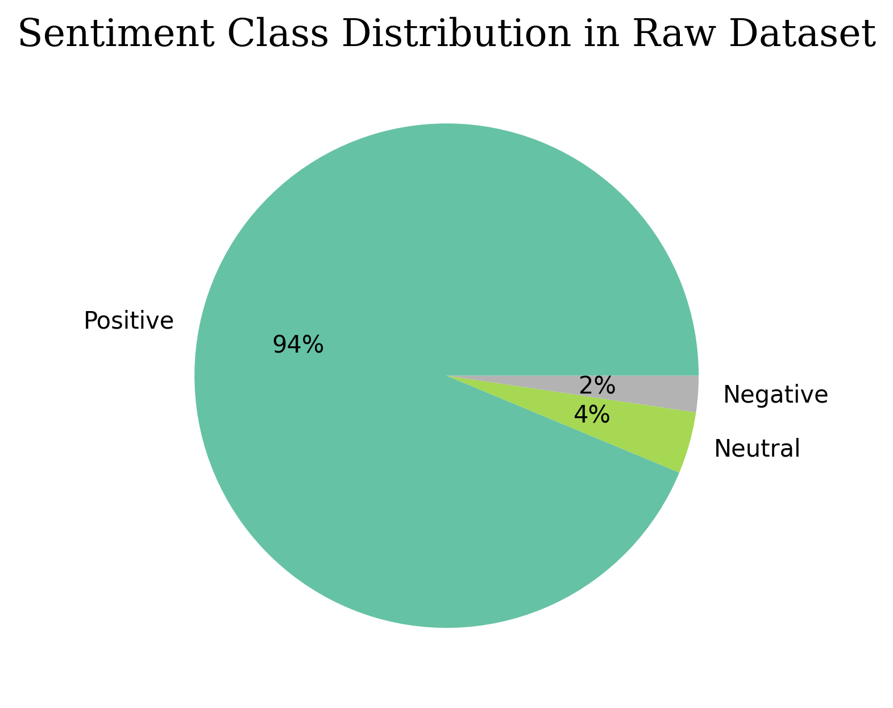
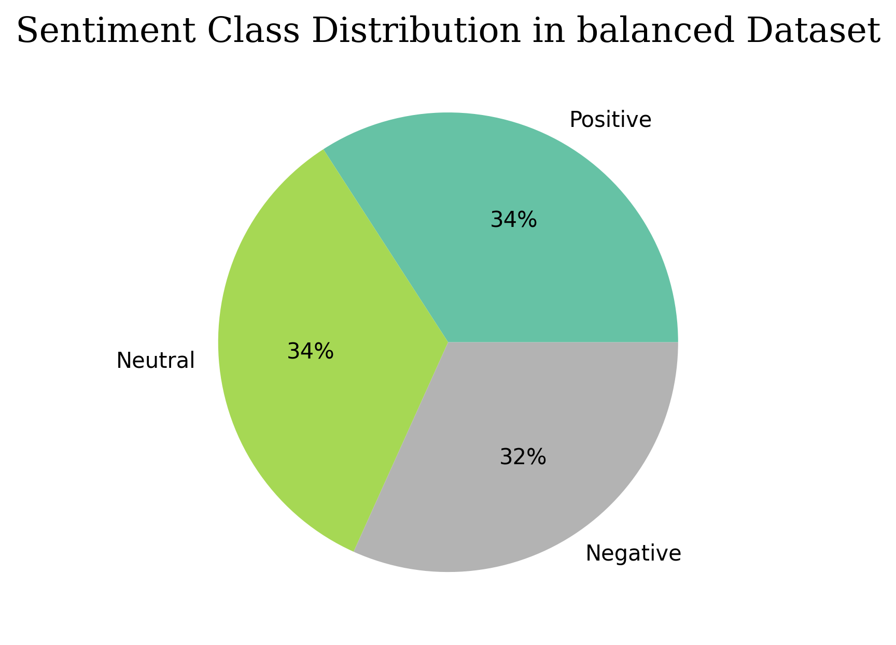
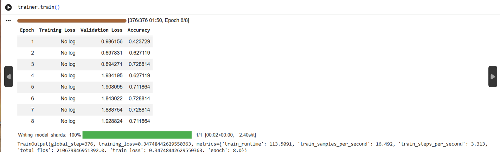

# Transformers in E-Commerce

This project explores how **transformer models** can be applied to solve real-world
e-commerce problems: from understanding customer sentiment to answering store-specific questions.

---

## Projects

### 1.  Customer Feedback Analysis - [`CustomerFeedbackAnalysis`](./CustomerFeedbackAnalysis)
Fine-tuned a **RoBERTa-base** model to automatically classify customer reviews into
**positive**, **neutral**, and **negative** sentiments.
A pretrained ready-to-use transformer was also tested for comparison purposes.

---

### 2.  Semantic Product Recommendation - [`ProductRecommendations`](./ProductRecommendations)
Built a recommendation system that goes beyond simple keyword matching.
It understands the **semantic meaning** behind a user's search query
to suggest the most relevant products.

---

### 3.  E-Store Chatbot - [`ChatBot`](./ChatBot)
Fine-tuned a transformer to act as a chatbot capable of answering
**domain-specific questions** related to our e-commerce store.

##  Customer Feedback Analysis

### Overview
The goal of this task is to fine-tune a **RoBERTa-base** classifier
to automatically classify customer reviews into three sentiment categories:
**positive**, **neutral** and **negative**.

The dataset was sourced from **Kaggle** and contains customer reviews
already labeled with their corresponding sentiment.

---

### What is RoBERTa?
**RoBERTa** (Robustly Optimized BERT Approach) is a transformer model developed by Facebook AI.
It is an improved version of BERT, trained on more data, for longer,
with better training strategies. It has shown strong performance on
text classification tasks like sentiment analysis.

---

### Approach
Although HuggingFace already offers a ready-to-use sentiment classifier based on RoBERTa -
[twitter-roberta-base-sentiment](https://huggingface.co/cardiffnlp/twitter-roberta-base-sentiment-latest) -
which can classify text out of the box without any training,
I chose to fine-tune the base **roberta-base** model from scratch on our dataset,
for the purpose of learning how the fine-tuning pipeline works end to end.

---

### Step 1 - Handling Class Imbalance
The first issue encountered was that the dataset was **imbalanced**:
some sentiment classes had significantly more samples than others,
which can bias the model during training.



To fix this, a **balanced dataset** was prepared with:
-  100 Positive reviews
-  100 Neutral reviews
-  93 Negative reviews



Full code available here:
[`01_data_collection_and_balancing.ipynb`](./CustomerFeedbackAnalysis/01_data_collection_and_balancing.ipynb)

---

### Understanding Logits

Before training, it is important to understand what the model outputs.
For a classifier with 3 classes `{0, 1, 2}`, the model does not directly return a label.
It returns **logits** which is  a tensor containing one raw score per class:

```python
prompt = "This product is amazing!"
tokenized_prompt = tokenizer(prompt, return_tensors="pt", padding=True, truncation=True)
output = model(**tokenized_prompt)

# raw logits
print(output.logits)
```

```
tensor([[ 0.0982, -0.0405,  0.0472]], grad_fn=<AddmmBackward0>)
          ↑         ↑        ↑
        class 0   class 1  class 2
```

Each number is a raw score (not a probability yet).
The higher the score, the more confident the model is about that class.

To convert logits into **probabilities** use `torch.softmax()`:

```python
probabilities = torch.softmax(output.logits, dim=1)
print(probabilities)
# tensor([[0.3712, 0.3223, 0.3065]])
#          ↑        ↑       ↑
#        class 0  class 1  class 2  → all sum to 1.0
```

To get the **predicted class** use `torch.argmax()`:

```python
prediction = torch.argmax(probabilities, dim=1).item()
print(prediction)
# tensor([0])  → the model predicts class 0 (negative)
```

### Step 2 - Training
Once the balanced dataset was ready, the **`roberta-base`** model was fine-tuned
on the prepared data for sentiment classification.


The following snippet is the **core code used to fine-tune RoBERTa** — or any transformer in general.
Keep in mind that the preparation of `train_dataset` and `test_dataset` depends on the transformer task
and must be formatted accordingly before being passed to the `Trainer`.

```python
from transformers import RobertaTokenizer, RobertaForSequenceClassification
from transformers import Trainer, TrainingArguments

# load tokenizer and model
tokenizer = RobertaTokenizer.from_pretrained("roberta-base")
model = RobertaForSequenceClassification.from_pretrained("roberta-base", num_labels=3)

# define training configuration
training_args = TrainingArguments(
    output_dir="./roberta-sentiment",        # where to save model checkpoints
    num_train_epochs=5,                      # number of training epochs
    per_device_train_batch_size=8,           # batch size per device
    eval_strategy="epoch",                   # evaluate at the end of each epoch
    report_to="none"                         # disable external logging
)

# define trainer
trainer = Trainer(
    model=model,
    args=training_args,
    train_dataset=train_dataset,
    eval_dataset=test_dataset,
    processing_class=tokenizer,
    compute_metrics=compute_metrics
)

# start training
trainer.train()

# save the fine-tuned model and tokenizer
trainer.save_model("./roberta-sentiment-final")
tokenizer.save_pretrained("./roberta-sentiment-final")
```

Since we are training a **classifier**, the `train_dataset` and `eval_dataset` must follow a specific structure.
Each dataset is a **list of dictionaries**, where every dictionary represents one input example and must contain:

- `input_ids` : the tokenized representation of the input text
- `attention_mask` : indicates which tokens should be attended to
- `labels` : the label corresponding to the input (e.g. `0` for negative, `1` for neutral, `2` for positive)

```json
[
  {
    "input_ids": [...],
    "attention_mask": [...],
    "labels": 2
  },
  {
    "input_ids": [...],
    "attention_mask": [...],
    "labels": 0
  }
]
```

Below is the snippet used to prepare both `train_dataset` and `eval_dataset`
into the required format before passing them to the `Trainer`:

```python
# prepare training dataset
train_dataset = []
for i in range(len(train_inputs)):
    input_ids = tokenized_train_inputs["input_ids"][i]
    attention_mask = tokenized_train_inputs["attention_mask"][i]
    label = train_labels[i].item()
    train_dataset.append({
        "input_ids": input_ids,
        "attention_mask": attention_mask,
        "labels": label
    })

# prepare evaluation dataset
test_dataset = []
for i in range(len(test_inputs)):
    input_ids = tokenized_test_inputs["input_ids"][i]
    attention_mask = tokenized_test_inputs["attention_mask"][i]
    label = test_labels[i].item()
    test_dataset.append({
        "input_ids": input_ids,
        "attention_mask": attention_mask,
        "labels": label
    })
```

### Training Output

The model was trained for **8 epochs**, reaching a best accuracy of **~72.8%**
with a training loss of **0.347**.



You can find all the notebook code related to: splitting raw data between train and test, preparing the dataset in the correct format, training the model and saving it here:

[`training_model.ipynb`](./CustomerFeedbackAnalysis/training_model.ipynb)

### Step 3 : Evaluation and Comparison

Once the model is trained and saved, we reload it and evaluate its accuracy on the test set.
A custom function was defined to compute the accuracy of any given model:

```python
def get_model_accuracy(model, tokenizer, dframe):
    df = dframe.copy()
    df["predicted_class"] = 0
    for index, row in df.iterrows():
        sentiment = row["reviews.text"]
        tokenized_sentiment = tokenizer(
            sentiment,
            return_tensors="pt",
            truncation=True,
            padding=True,
            max_length=512
        )
        output = model(**tokenized_sentiment)
        logits = output.logits
        model_prediction_value = torch.argmax(logits, dim=1).item()
        df.at[index, "predicted_class"] = model_prediction_value
    correct_predictions = (df["predicted_class"] == df["class"]).sum()
    accuracy = round((correct_predictions / len(df)) * 100, 2)
    return accuracy
```

This function was then used to compare the accuracy of our fine-tuned model
against the ready-to-use **Twitter RoBERTa** model:

```
Accuracy of Twitter Sentiment Model : 89.55 %
Accuracy of Our Trained Model       : 74.25 %
```

The Twitter model achieves higher accuracy since it was trained on a much larger dataset.
Our model still performs reasonably well (74.25%) given it was trained on only ~293 samples,
which confirms that fine-tuning even on a small balanced dataset can yield decent results.

You can find all the code related to this step here:
[`Use_Trained_Model.ipynb`](./CustomerFeedbackAnalysis/Use_Trained_Model.ipynb)


## Semantic Product Recommendation

### Dataset

The dataset used is the **Flipkart Ecommerce Dataset** sourced from Kaggle.
It contains product information such as: names, descriptions, specifications, prices and ratings.

Dataset link: [Flipkart Ecommerce Dataset](https://www.kaggle.com/datasets/atharvjairath/flipkart-ecommerce-dataset)

---

### Goal

Traditional search systems match products based on **keywords only**.
The goal of this project is to go further by understanding the **semantic meaning** behind a user query
and returning the most relevant products even if the exact keywords are not present.

---

### Approach : Semantic Embeddings with SentenceTransformers

To achieve semantic search, we used the **SentenceTransformer** embedding model
[`all-mpnet-base-v2`](https://huggingface.co/sentence-transformers/all-mpnet-base-v2)
to convert text into vector representations (embeddings).

Each product was embedded by combining three key textual fields:
`product name`, `description` and `specifications` into a single text,
then encoded into a semantic vector.

---

### Recommendation Function

A function was defined to retrieve the **top N most relevant products** for a given user query.
It works by encoding the user input into a vector, then computing the **cosine similarity**
between that vector and all product embeddings, and finally returning the most similar products:

```python
def get_products(user_input, products_dataframe, embeddings,
                 embedding_model=model, recommendation_num=10):

    user_input = re.sub(r"[^a-zA-z0-9]", " ", user_input)
    user_embedding_vector = embedding_model.encode([user_input])
    similarities = cosine_similarity(user_embedding_vector, embeddings)
    similarities = similarities[0]
    sorted_indices_desc = similarities.argsort()[::-1]
    recommended_products_indexes = sorted_indices_desc[0:recommendation_num + 1]
    recommended_products = products_dataframe.iloc[recommended_products_indexes, [3, 5, 10]]
    return recommended_products
```

---

### Result

After testing with a natural language query such as:
`"Looking for a budget smartphone under 15000 with good camera"`,
the system successfully returns the 10 most relevant products based on semantic similarity,
going beyond simple keyword matching.

---

Full code available here:
[`product_recommendation.ipynb`](./ProductRecommendations/product_recommendation.ipynb)
and here:
[`semantic_product_recommendation.ipynb`](./ProductRecommendations/semantic_product_recommendation.ipynb)

## EStore Chatbot

### Approach

For this task, we fine-tuned a **GPT-2** model on a custom Q&A dataset
so it can answer questions specifically related to our estore.

The same training methodology was used (Trainer and TrainingArguments),
however since GPT-2 is a **Causal Language Model**, the training dataset
requires a different format compared to the classifier task.

---

### Training Dataset Format

The dataset is a **HuggingFace Dataset** where each row is a dictionary.
Since GPT-2 learns by predicting the next token from a flat string,
the question and answer are merged into a single text field:

```python
{
    "input_ids":      [15496, 25, 995, 318, ...],
    "attention_mask": [1, 1, 1, 1, ...]
}
```

Each row was formatted as follows before tokenization:

```
"Question: {question}\nAnswer: {answer}<|endoftext|>"
```

There are no separate labels here since GPT-2 learns by predicting
the next token from the input itself (the DataCollator handles that automatically
with `mlm=False`).

---

### Result

After training, the model was able to answer questions related to the estore,
responding with coherent and relevant answers based on what it learned
from the training dataset.

---

Full code available here:
[`training_model_for_chatbot.ipynb`](./ChatBot/training_model_for_chatbot.ipynb)
and here:
[`use_trained_model.ipynb`](./use_trained_model.ipynb)
